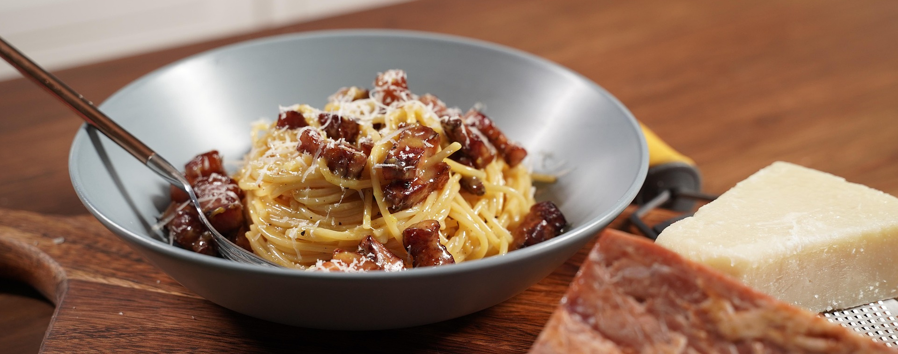

# 🍕 Mampfen-rando

**Authentische italienische Küche mit Liebe zubereitet**

Eine moderne Webapplikation für ein italienisches Restaurant mit Online-Bestellsystem, entwickelt mit reinem JavaScript, HTML und CSS.



## ✨ Features

- 🍕 **Vielfältige Speisekarte** - Pizza, Pasta, Salate und Desserts
- 🛒 **Warenkorb-System** - Einfaches Hinzufügen und Verwalten von Bestellungen
- 📱 **Responsive Design** - Optimiert für Desktop, Tablet und Mobile
- 🚚 **Schnelle Lieferung** - In 30 Minuten bei Ihnen zu Hause
- 🎨 **Moderne UI/UX** - Benutzerfreundliche Oberfläche
- 💾 **Local Storage** - Warenkorb bleibt beim Neuladen erhalten

## 🍽️ Speisekategorien

### 🍕 Pizza

- Pizza Margherita
- Pizza Salami
- Pizza Funghi
- Pizza Vegetarisch

### 🍝 Pasta

- Spaghetti Carbonara
- Spaghetti Bolognese

### 🥗 Salate

- Caesar Salad
- Mixed Salad

### 🍰 Desserts

- Tiramisu
- Panna Cotta

## 🚀 Live Demo

[Demo Link hier einfügen]

## 🛠️ Technologien

- **Frontend**: HTML5, CSS3, JavaScript (ES6+)
- **Architektur**: Modulare JavaScript-Struktur
- **Styling**: Custom CSS mit Komponenten-basiertem Ansatz
- **Icons**: SVG Icons
- **Responsive**: Mobile-First Design

## 📁 Projektstruktur

```
Mampfen-rando/
├── index.html              # Hauptdatei
├── assets/
│   ├── icons/              # SVG Icons
│   └── img/                # Bilder der Speisen
├── scripts/
│   ├── cart-*.js           # Warenkorb-Funktionalität
│   ├── navigation-*.js     # Navigation & Routing
│   ├── data.js             # Speisedaten
│   └── storage.js          # Local Storage Management
├── styles/
│   ├── global.css          # Globale Styles
│   └── components/         # Komponenten-spezifische Styles
└── templates/              # HTML-Templates für verschiedene Seiten
```

## 🎯 Hauptfunktionen

### Warenkorb-System

- Artikel hinzufügen/entfernen
- Mengenänderung
- Preisberechnung
- Persistierung über Browser-Sessions

### Navigation

- Single Page Application (SPA) Verhalten
- Mobile-optimierte Navigation
- Smooth Scrolling zwischen Sektionen

### Responsive Design

- Mobile-First Ansatz
- Flexible Grid-Layouts
- Touch-optimierte Buttons

## 🚀 Installation & Setup

1. **Repository klonen**

   ```bash
   git clone https://github.com/rockviktor78/Bestellapp.git
   cd Bestellapp
   ```

2. **Live Server starten**

   ```bash
   # Mit Python
   python -m http.server 8000

   # Mit Node.js (http-server)
   npx http-server

   # Mit Live Server Extension in VS Code
   ```

3. **Im Browser öffnen**
   ```
   http://localhost:8000
   ```

## 📱 Responsive Breakpoints

- **Mobile**: < 768px
- **Tablet**: 768px - 1024px
- **Desktop**: > 1024px

## 🎨 Design System

### Farbschema

- **Primary**: Italienische Rot- und Grüntöne
- **Secondary**: Warme Erdtöne
- **Accent**: Gold für Highlights

### Typografie

- Moderne, lesbare Schriftarten
- Hierarchische Überschriftenstruktur
- Optimierte Zeilenhöhen

## 🔧 Browser-Unterstützung

- ✅ Chrome (Latest)
- ✅ Firefox (Latest)
- ✅ Safari (Latest)
- ✅ Edge (Latest)

## 📄 Seiten

- **Home** - Willkommensseite mit Kategorien-Übersicht
- **Menü** - Vollständige Speisekarte mit Filteroptionen
- **Warenkorb** - Bestellübersicht und Checkout
- **Über uns** - Restaurant-Information
- **Kontakt** - Kontaktformular und Standort
- **Impressum** - Rechtliche Informationen
- **Datenschutz** - Datenschutzerklärung
- **AGB** - Allgemeine Geschäftsbedingungen

## 🤝 Contributing

1. Fork das Repository
2. Feature Branch erstellen (`git checkout -b feature/amazing-feature`)
3. Changes committen (`git commit -m 'Add amazing feature'`)
4. Branch pushen (`git push origin feature/amazing-feature`)
5. Pull Request öffnen

## 📝 Lizenz

Dieses Projekt steht unter der [MIT Lizenz](LICENSE).

## 👨‍💻 Autor

**Viktor Rock** - [@rockviktor78](https://github.com/rockviktor78)

## 📞 Kontakt

- 📧 Email: [Ihre Email hier]
- 🌐 Website: [Ihre Website hier]
- 📱 Social Media: [Links hier]

---

⭐ **Star dieses Repository wenn es dir gefällt!**

_Buon Appetito! 🇮🇹_
